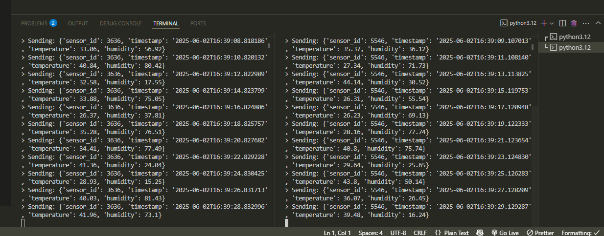
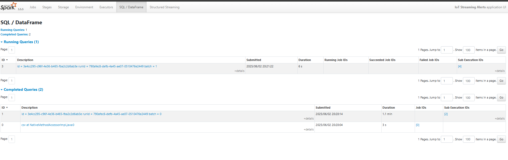
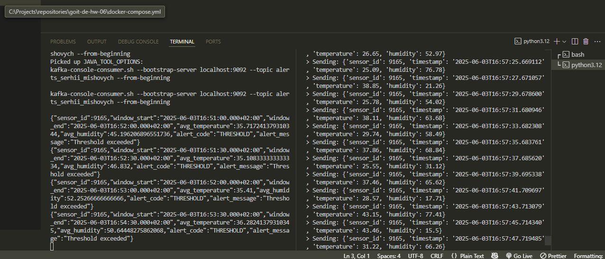

## Step 1: Data Generation

In this step, I implemented a Python script (sensor_data_producer.py) to generate sensor data and send it to the Kafka topic building_sensors_serhii_mishovych. The script runs in an infinite loop and sends data with fields: sensor_id, temperature, humidity, and timestamp.

I ran two instances of this script in separate terminals to simulate multiple data producers running at the same time. Below is the screenshot demonstrating both terminals running the data generation script.

## Step 2: Aggregation

Screenshot below shows that streaming query is running with sliding window and watermark.

## Step 3: Alerts Conditions

In this step, I prepared the alerts_conditions.csv file which contains the thresholds for temperature and humidity that define alerts. The CSV file includes fields like sensor_id, max_temperature, min_temperature, max_humidity, and min_humidity.

This file is used by the Spark Streaming job to join aggregated data with alert thresholds and determine which records should be flagged as alerts.

## Step 4: Filtering Alerts

In this step, Spark Streaming reads aggregated data and joins it with the alerts conditions. If the average temperature or humidity exceeds the thresholds defined in the CSV file, an alert is generated. This step uses a cross join and filtering logic to detect threshold violations.

## Step 5: Writing Alerts to Kafka

In this step, filtered alerts are written back to a Kafka topic called alerts_serhii_mishovych. I used a Kafka console consumer to verify that the alerts are correctly published in JSON format.

Below is a screenshot showing an alert message received in the Kafka topic.

